# Peblo Story Buddy

An interactive AI Story Buddy and data-driven quiz, built for the Peblo "AI Story Buddy & Quiz" challenge. The app narrates a short story to a child, then transitions into a quiz rendered entirely from a JSON object — built and tuned with mid-range Indian Android hardware (~3GB RAM) as the primary constraint throughout.

| Field | Value |
|---|---|
| App display name | Peblo Story Buddy |
| Android package / `applicationId` | `com.peblo.storybuddy` |
| Flutter project (pubspec) name | `peblo_story_buddy` |
| Framework | Flutter (Dart), Material 3 |
| State management | Riverpod |

---

## 1. Why Flutter

- A single codebase covers the primary audience — mid-range Android devices in India — while staying portable to iOS without a layout rewrite.
- Flutter's widget lifecycle, paired with Riverpod, makes it straightforward to isolate expensive animations (shake, confetti) into their own subtrees, which mattered a lot once I started profiling on real hardware (see §8).
- `flutter_tts` gives direct access to the native on-device speech engine on both platforms, with no server dependency for the core narration flow.

---

## 2. Managing the Audio → Quiz Transition

The whole feature is driven by one state machine:

```dart
enum AppPlaybackState { idle, preparing, playing, finished, error }
```

1. Tapping **"Read Me a Story"** moves state from `idle` to `preparing` — the button disables itself and shows a spinner immediately.
2. Once `flutter_tts` confirms playback has actually started, state moves to `playing`, and the Buddy character swaps to its talking pose with an updated dialogue bubble.
3. `FlutterTts.setCompletionHandler` fires when narration ends naturally → state moves to `finished`.
4. Only a small, leaf-level widget watches that transition — not the screen root. When it sees `finished`, it triggers an `AnimatedSwitcher` (fade + slight upward slide) to reveal the quiz card, and the view smoothly scrolls down to meet it. Because the watcher is scoped narrowly, the header, the Buddy illustration, and the story card never rebuild during this transition.
5. If the platform TTS layer errors out (or a 5-second safety timer trips during preparation), state moves to `error` and a friendly retry message appears — the quiz stays hidden, and the app never hangs.

I originally drove this transition by watching providers directly at the screen root. That turned out to be the actual cause of a chunk of the jank described in §8 — covered there in detail.

---

## 3. Building the Quiz to Be Data-Driven

The quiz renders entirely from a JSON object — nothing about its layout is hardcoded to a specific question or option count:

```json
{
  "question": "What colour was Pip the Robot's lost gear?",
  "options": ["Red", "Green", "Blue", "Yellow"],
  "answer": "Blue"
}
```

- `QuizQuestion.fromJson()` parses defensively: missing/blank fields fall back to friendly defaults, malformed or empty `options` lists are filtered and backstopped, and any unrecognized keys are captured into an `extraMetadata` map instead of crashing the parser.
- Options are built with `List.generate(question.options.length, ...)` — there's no `Option1`/`Option2`/`Option3` widget anywhere. Letter avatars (A, B, C…) are generated with `String.fromCharCode(65 + index)`, so the UI scales automatically whether the backend sends 2 options or 6.
- I verified this by swapping the JSON's option count and text without touching the widget code — the layout adapts on its own.

---

## 4. Audio Loading & Failure States

- **Preparing:** the button disables and shows "Preparing Audio..." with a small spinner the moment it's tapped.
- **Failure:** `FlutterTts.setErrorHandler` routes the state to `error`, surfacing an amber retry control.
- **No-hang guarantee:** a 5-second safety timer runs alongside the platform preparation call. If the device's TTS engine never calls back, the app forces a transition to the error state instead of freezing.
- Narration is tuned for a child listener: speech rate `0.4`, pitch `1.3`.

---

## 5. Caching & Core Narration Approach

The shipped build uses the **on-device native TTS engine** (`flutter_tts`) rather than a remote streaming API. This was a deliberate choice to keep the app lightweight, fast, and stable on ~3GB RAM devices under unpredictable network conditions — synthesizing locally means zero network round-trips and full offline operation.

I did evaluate a cloud TTS option (a free-tier streaming provider) during development to see if voice quality would justify it. On real-device testing it introduced noticeable latency spikes and occasional connection failures over a restricted network — the opposite of what a young child's app needs. I made the call to drop it and instead spend that effort tuning the native engine's rate/pitch settings, which I think was the right trade for this constraint.

If a remote TTS pipeline were added later, the caching design I'd use is:
- Persist synthesized audio locally via `path_provider`, keyed by a SHA-256 hash of the story text + voice parameters.
- Evict old entries with a simple LRU policy so the cache doesn't grow unbounded on limited device storage.

---

## 6. Interaction Design

- **Wrong answer:** the card shakes (a custom `TweenSequence<double>` driving `Transform.translate`) with haptic feedback, and the child can try again immediately — nothing locks up or navigates away.
- **Correct answer:** a capped confetti burst plays, the Buddy switches to a celebrating pose, and a "Success" card appears with a "Play Again" option.

---

## 7. Memory & Rendering Discipline (~3GB RAM target)

- `const` constructors wherever a widget is static, so Flutter reuses the same object reference across rebuilds instead of reallocating.
- No widget tree rebuilds at the screen root for interaction-driven state (quiz answers, shake, confetti) — each of those lives in its own scoped `ConsumerWidget`/`ConsumerStatefulWidget`. Section 8 walks through how I found and fixed the cases where this rule was being silently broken.
- Flat `Border.all()` strokes instead of blurred `BoxShadow` decorations anywhere a widget rebuilds frequently — blur is expensive to rasterize and was a direct cause of two of the jank cases in §8.
- Card elevation kept to 2–4; no `BackdropFilter` anywhere.
- Confetti capped to a small particle count per burst and a 1.5-second total runtime, wrapped in its own `RepaintBoundary` so its particle redraw doesn't propagate to the rest of the screen.
- Every `AnimationController`, TTS handler, and listener is disposed explicitly.

---

## 8. Performance Profiling — the Full Journey

I didn't get this right on the first pass. Below is the actual sequence of profiling runs, what each one revealed, what I changed, and what it measured afterward. All DevTools captures were taken with `flutter run --profile`; the on-device overlay captures in Stage 4 were taken on a **Samsung Galaxy M31s** (Exynos 9611 / Mali-G72, 60Hz) — a six-year-old, genuinely mid-range device, since that's a closer match to Peblo's real target hardware than a desktop emulator.

### Stage 1 — Baseline (first profiling pass)

The first thing I checked was the shake animation and the confetti celebration.

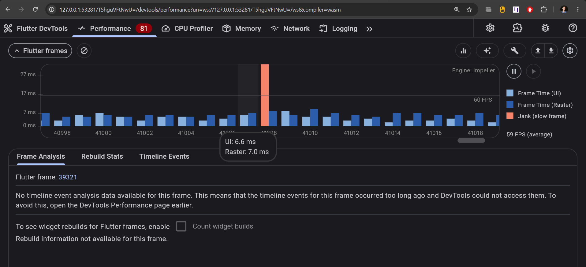
*Isolated jank on the wrong-answer shake — UI 6.6ms / Raster 7.0ms on a single frame. Not severe, but a sign the animation wasn't fully isolated.*

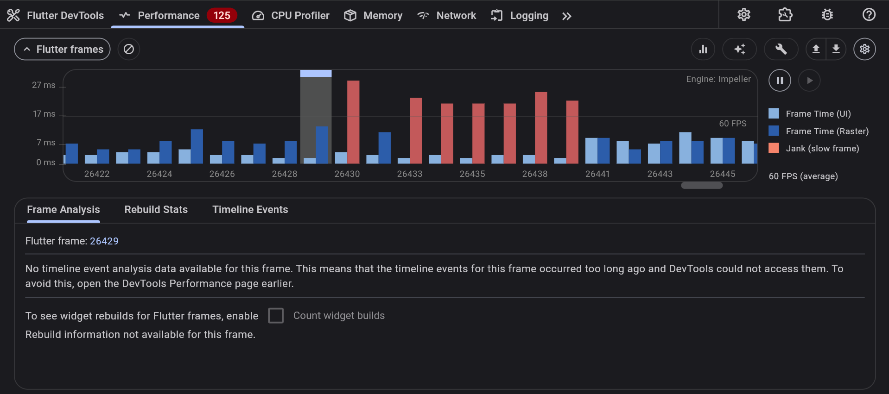
*A real jank cluster — several consecutive frames over budget — right when the success card and confetti appeared together.*

**Diagnosis:** the confetti widget and the success card content were rebuilding and rasterizing in the same pass, with no isolation between them.

**Fix:** wrapped the success-card content and each `ConfettiWidget` emitter in its own `RepaintBoundary`, and capped the confetti to ~8 particles per burst with a 1.5s runtime limit instead of letting it run unbounded.

### Stage 2 — After Repaint Isolation

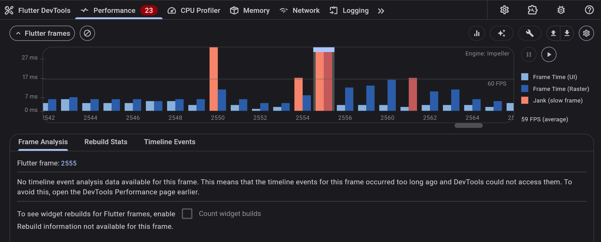
*Re-running the same correct-answer flow: the jank cluster is gone, leaving one residual single-frame blip, average holding at 59fps.*

This was a real improvement, but while testing the surrounding UX I noticed a separate issue: the screen was auto-scrolling on state changes, and it was teleporting rather than animating — an uncontrolled `SingleChildScrollView` snap whenever the visible content's height changed (success card replacing the quiz card, or collapsing back to nothing on reset). I replaced that implicit behavior with an explicit `ScrollController` + `Scrollable.ensureVisible()` call, animated over 450ms with an `easeOutCubic` curve, triggered only on the specific state transitions that need it.

### Stage 3 — New Device, Three New Spikes

Testing again on different hardware turned up three more distinct issues, each with a different signature:

| Action | UI thread | Raster thread | Screenshot |
|---|---|---|---|
| Tap "Read Me a Story" | — | jank cluster, frames 8316–8339 | `04_start_listening_jank_cluster.png` |
| Tap a wrong answer | 4.4ms | **18.1ms** (raster-bound) | `05_wrong_answer_raster_spike.png` |
| Tap the correct answer | **125.1ms** (UI-bound) | 5.5ms | `06_correct_answer_ui_spike.png` |

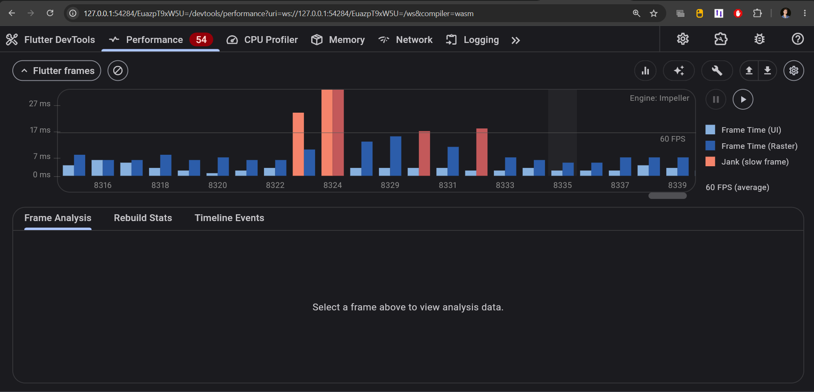

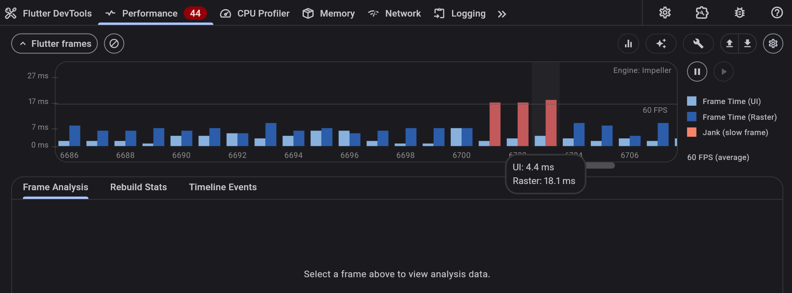

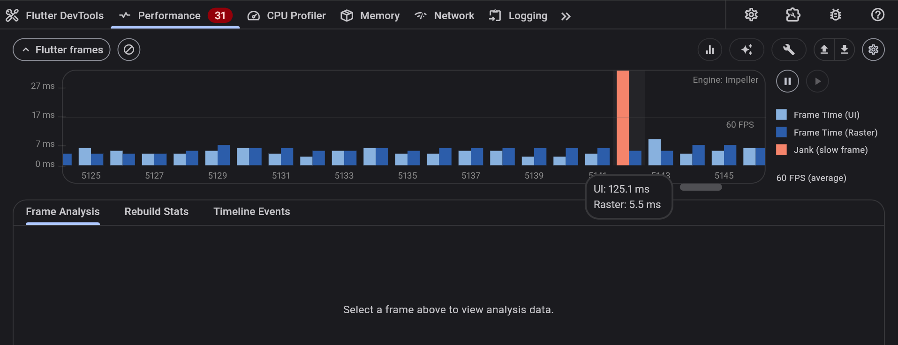

Three different problems hiding in three different threads:

1. **Start-listening cluster:** the Buddy's dialogue bubble used a `BoxShadow(blurRadius: 6)` inside an `AnimatedContainer` that re-renders on every playback-state change (idle → preparing → playing fires twice in quick succession). Blurred shadows are expensive to rasterize, and this one was recomputing on every transition.
2. **Wrong-answer raster spike (18.1ms):** the quiz options used a `BoxShadow` on the selected state, recomputed across all four options simultaneously during the shake. Raster-bound, not UI-bound — classic blur-on-rebuild signature.
3. **Correct-answer UI spike (125.1ms):** this one was on the UI thread, not raster — the signature of a synchronous one-time cost. It traced back to the custom display font being fetched at runtime on its first use, rather than bundled locally.

**Fixes applied:**
- Removed `boxShadow` from both the dialogue bubble and the quiz option decorations, replacing them with flat 1.5–2px borders.
- Disabled runtime font fetching and bundled the display font as a local asset instead, so there's no network dependency in the render path at all.

### Stage 4 — Final, On-Device Verification

After all three fixes, I moved off DevTools entirely and measured with Flutter's on-device performance overlay on the M31s, across every interactive state in the app:

| State | Raster max | Raster avg | UI max | UI avg | Screenshot |
|---|---|---|---|---|---|
| Idle | 9.8ms | 6.7ms | 7.5ms | 3.1ms | `07_overlay_idle.png` |
| Listening | 9.9ms | 6.9ms | 9.9ms | 3.0ms | `08_overlay_listening.png` |
| First wrong answer | 19.4ms | 6.3ms | 15.5ms | 2.2ms | `09_overlay_wrong_first.png` |
| All options tried wrong | 10.3ms | 6.5ms | 8.4ms | 2.6ms | `10_overlay_wrong_all.png` |
| Success + confetti | 13.6ms | 7.2ms | 6.4ms | 3.1ms | `11_overlay_success.png` |

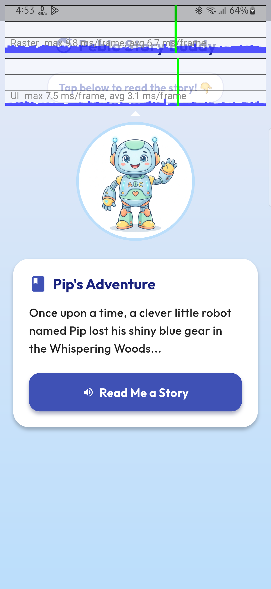
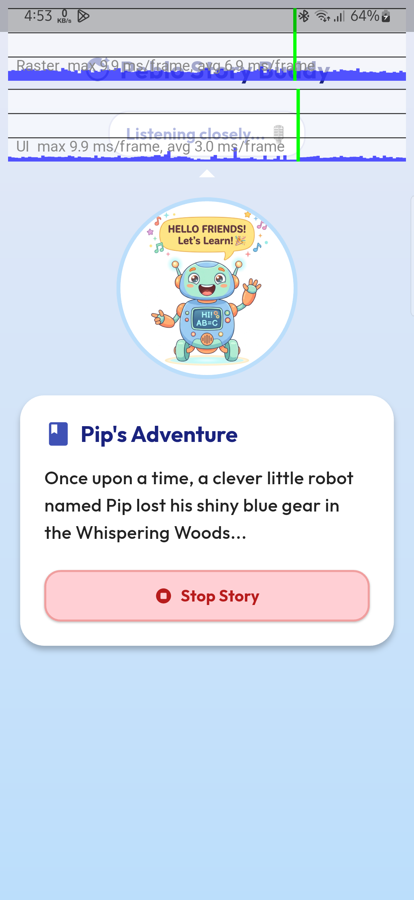
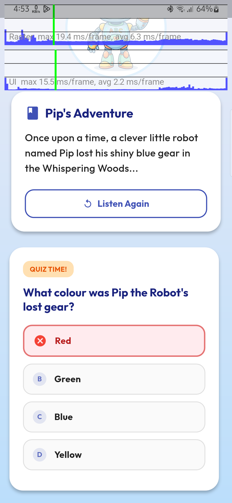
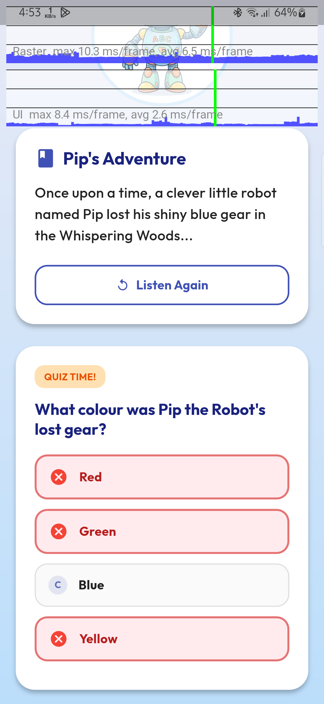
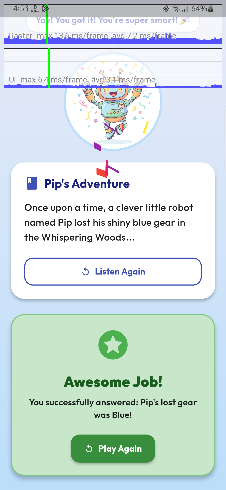

Average raster/UI time stays well inside the 16.6ms-per-frame budget for 60fps across every state. The one remaining outlier — a 19.4ms raster peak on the very first wrong answer — is a single transient frame (the shake animation's very first tick, before the animation curve is warmed up), not a sustained cluster, and it doesn't recur on subsequent wrong attempts (10.3ms max on the next run of the same interaction).

### Before vs. After, Summary

| Issue | Before | After |
|---|---|---|
| Confetti celebration | Multi-frame jank cluster | Isolated single residual frame, then clean |
| Screen transitions | Instant scroll teleport | Smooth 450ms animated scroll |
| Buddy dialogue bubble updates | Jank cluster (8316–8339) | No cluster, max 9.9ms raster |
| Wrong-answer feedback | 18.1ms raster spike | 19.4ms single transient → 10.3ms steady-state |
| Correct-answer feedback | 125.1ms UI-thread spike | 6.4ms max UI thread |

---

## 9. Development Notes

- The state layer originally used `StateNotifier`; I migrated it to Riverpod's `Notifier`/`NotifierProvider` for cleaner lifecycle handling via `ref.onDispose` and `ref.mounted` checks.
- Hit a Gradle build failure on Windows (`compileDebugKotlin` step, path-root mismatch) caused by the project sitting on a different drive than the global Flutter pub cache — fixed by disabling Kotlin incremental compilation in `android/gradle.properties`.
- I used AI tools during development for research — looking up optimization techniques, sanity-checking profiling interpretations, and getting a second opinion on Flutter performance patterns. One suggestion I rejected outright was an early documentation draft that mixed in patterns from a completely different UI framework than the one this project actually uses — I caught the mismatch and rewrote that section myself to match the real codebase. I also tried integrating a cloud TTS provider as a bonus feature, found it introduced real latency/reliability problems on a constrained network, and made the judgment call to ship the native on-device engine instead (see §5).

---

## 10. App Screens

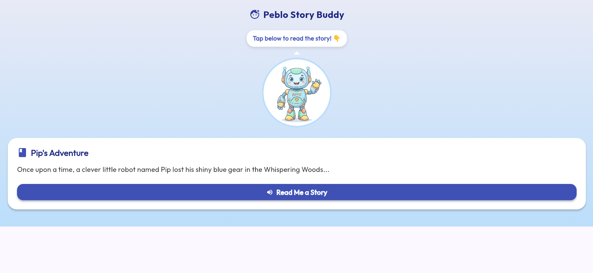
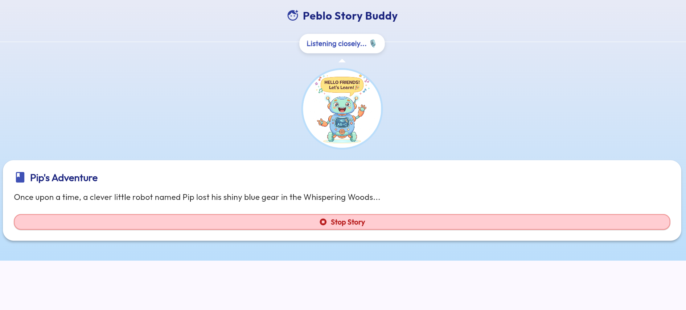
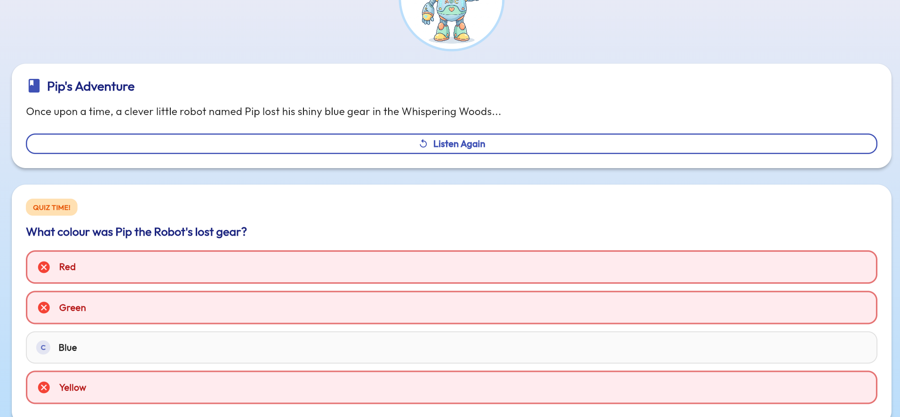
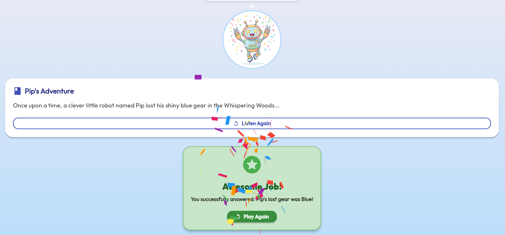
